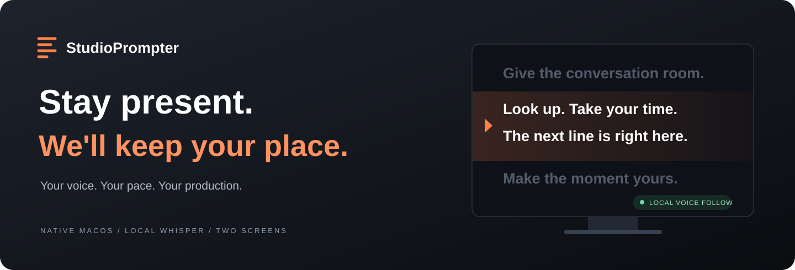

<p align="center">
  
</p>

<p align="center">
  <a href="https://github.com/codebooker/StudioPrompter/actions/workflows/ci.yml"></a>
  
  
  <a href="LICENSE"></a>
</p>

<p align="center"><strong>A native Mac teleprompter built for the person on camera—and the producer behind it.</strong></p>
<p align="center">At your webcam or across the studio. A script that follows your voice.</p>
<p align="center"><a href="https://studioprompter.app">Try the browser studio</a> · <a href="https://github.com/codebooker/StudioPrompter/releases">Releases</a> · <a href="docs/USER-GUIDE.md">User guide</a> · <a href="docs/TESTING.md">Testing & release status</a> · <a href="https://github.com/codebooker/StudioPrompter/issues">Feedback</a></p>

---

## Your studio, in sync

Record solo with a compact script near your webcam, or keep the controls on your Mac while a clean, full-screen script appears on the talent monitor. Choose either from **Prompter Output**. Adjust the type, move the reading guide, or take over the scroll from the producer workspace.

| For the producer | For the presenter |
| :--- | :--- |
| A searchable Markdown script library, emphasis, and named bookmarks | A clean, borderless display with generous type |
| Live preview and manual wheel, drag, and keyboard control | Adjustable reading guide and focus highlighting |
| One Play button for the microphone and prompting | Voice following that tolerates skipped words |
| Microphone **and individual input channel** selection | Mirrored or flipped output for prompter glass |
| Instant blackout and synchronized display controls | A producer who can step in for a retake |

## Your iPad, in sync

**StudioPrompter Companion** turns an iPad into a reading display controlled from your Mac, including mirrored output for teleprompter glass. Pair over the local network; scripts, microphone selection, and voice processing stay on the Mac. **Mac 0.2.0** includes iPad output. The companion is in internal TestFlight testing; external invitations are not available yet. Pairings survive restarts, and the producer can remove an iPad’s access even while it is offline. [Setup and development status](docs/IPAD-COMPANION.md).

## Read near your webcam

Choose **Webcam Layout** from the **Prompter Output** dropdown alongside your monitors. This compact, floating reading window is designed for solo recording. It starts near the webcam on a built-in display, respects camera cutouts, and can be dragged beneath an external webcam. Adjust width and height independently while keeping the same script position and controls.

## Hands-free takes · experimental

Stay in front of the camera. Enable **Voice prompting**, select your microphone/channel, and turn on **Hands-free commands**. The app listens even while prompting is paused. Say **“Hey Teleprompter”**, give one command, and briefly pause:

- “Start” or “pause.”
- “Go back two lines” or “start this paragraph over.”
- “Go to the next bookmark.”
- “Make the font bigger” or “increase the reading guide height.”

For more flexible wording, enable **Natural commands · Beta** in **Advanced voice settings** and click **Download command AI**. The optional Qwen 2.5 1.5B model downloads in the app (about 1.1 GB), then interprets supported commands locally through llama.cpp. Clear commands can also use the built-in parser without that extra model. No cloud account or API key is required.

Commands remain experimental; recognition can miss or misinterpret a request. Check the visible response. Pause keeps command listening available; **Esc** turns the microphone off. [Voice-command setup and behavior](docs/USER-GUIDE.md#voice-commands).

## Read naturally

**Follow script** listens for nearby phrases and moves the script with you. Skip a word, add a filler, or pause to think. Smooth movement keeps recognized text near the reading guide.

**Adaptive pace** adjusts to your speaking cadence, easing into faster speech and slowing down when you do. Nearby phrase matches help keep the guide close to your place.

**Take over whenever you need to.** While voice prompting is running, scroll back to a line. The mic stays on; the script waits for fresh speech at the new position before following again. Pause stops prompting and the microphone unless hands-free commands are enabled; in that mode, the mic stays available for your next command. **Esc** stops listening. With voice prompting off, manual scrolling pauses fixed-speed playback.

Voice features are in beta. Recognition and responsiveness depend on your Mac, microphone, speaking style, and script. English is currently supported.

## Start in four steps

1. **Open a script.** Write directly in the app or import TXT, Markdown, RTF, RTFD, DOC, or DOCX. Emphasize key passages with bold and underline, and place named bookmarks directly in the editor.
2. **Choose your output.** Open **Prompter Output** and select **Webcam Layout**, a connected monitor, or **Connect iPad…**. Mirror and flip controls are available for monitor and iPad output.
3. **Choose your pace.** Use fixed speed, or turn on **Voice prompting**, choose a mode and microphone channel, and click **Download model** once.
4. **Press Play.** Voice mode starts listening and prompting together. Or enable **Hands-free commands** and say “Hey Teleprompter, let’s go.” Space pauses prompting; Esc stops the mic.

Everyday controls live in the main window. **Advanced voice settings** is there when you want to tune—not a stop you have to make before every take.

### Local speech. Simple setup.

Whisper runs on your Mac through [WhisperKit](https://github.com/argmaxinc/argmax-oss-swift). The app downloads its model and tokenizer on demand, with progress and retry controls. No model account, command line, or API key is needed.

- **Base English** is the default for responsive live prompting.
- **Small English** is an optional larger model. Try it on your Mac before using it live; improved recognition can come with more delay.
- Audio is processed locally in memory. The app does not save audio or transcripts.
- Once setup completes, prompting works offline. Scripts and settings stay in your local library.

Using an audio interface? Select the interviewer's isolated channel so the guest's separate track does not drive the script. This is channel selection, not speaker identification; sound bleeding into the selected microphone can still be heard. See the [mixer setup guide](docs/USER-GUIDE.md#microphones-and-mixers).

## Get StudioPrompter

**[Download StudioPrompter 0.2.0 for Mac (.dmg)](https://github.com/codebooker/StudioPrompter/releases/download/0.2.0/StudioPrompter-0.2.0-macos-arm64.dmg)** · [Release notes and ZIP](https://github.com/codebooker/StudioPrompter/releases/tag/0.2.0)

For **Apple silicon Macs (M1 or newer), macOS 13.3+**. Open the DMG, drag `StudioPrompter.app` into Applications, and open it. A ZIP is also available on the release page. This early build is not notarized: if macOS blocks the first launch, use **System Settings → Privacy & Security → Open Anyway** for StudioPrompter. See [Apple’s instructions](https://support.apple.com/en-us/102445).

Follow script, Adaptive pace, the Markdown editor, bookmarks, dual-display output, **Webcam Layout**, and **iPad output** are included. **“Hey Teleprompter” commands and optional local command AI are available as experimental features** in this tester release. This is a tester release, not a production-readiness claim; [remaining validation](docs/TESTING.md) is documented.

[What changed in 0.2.0](docs/RELEASE-NOTES-0.2.0.md): iPad output, saved pairings, connection recovery, producer access controls, and an uncluttered companion display. Webcam Layout and experimental hands-free commands remain included.

Future tester releases arrive through **StudioPrompter → Check for Updates…**. Signed update archives are verified before installation; scripts and downloaded models stay on your Mac.

Developers can build now on macOS 13.3 or later with a recent Xcode or Swift toolchain:

```sh
git clone https://github.com/codebooker/StudioPrompter.git
cd StudioPrompter
./scripts/run.sh
```

For the hands-free features included in the 0.2.0 tester, use `STUDIO_EXPERIMENTAL_COMMANDS=1 ./scripts/run.sh`. Ordinary source builds leave the experiment disabled.

This creates and opens `dist/Prompter.app` with a local ad-hoc signature. It is a development build, not a notarized distribution. The app appears as **StudioPrompter** in macOS.

## Built for the Mac

SwiftUI for the workspace. AppKit for native windows and consistent text layout. Core Audio for isolated microphone channels. Core ML for local Whisper inference.

```sh
./scripts/check.sh                    # Core, layout, channel, and bundle checks
./scripts/check-speech.sh             # Download + real-model synthetic speech checks
./scripts/package-release.sh          # Versioned ZIP, checksum, and build metadata
```

See [development and packaging](docs/DEVELOPMENT.md) for architecture, signing, notarization, and release instructions. Contributions and focused bug reports are welcome; include your Mac, macOS version, voice mode, and steps to reproduce. Please avoid posting private scripts or recordings.

## Open source

StudioPrompter is licensed under [GNU AGPL v3](LICENSE). [WhisperKit and its bundled notices](ThirdParty) retain their respective licenses. Thanks to the Whisper, WhisperKit, Qwen, and llama.cpp teams for the local speech and command models and runtimes. Their licenses and notices are included in [ThirdParty](ThirdParty).

### Updates without the download dance

Choose **StudioPrompter → Check for Updates…** to get published tester releases from GitHub. [Sparkle](https://sparkle-project.org/) handles the signed download and Install & Relaunch flow, while your scripts and local speech models stay in place. Checks are manual so update prompts stay out of recording sessions. See [the update guide](docs/UPDATES.md) for release setup and validation.
